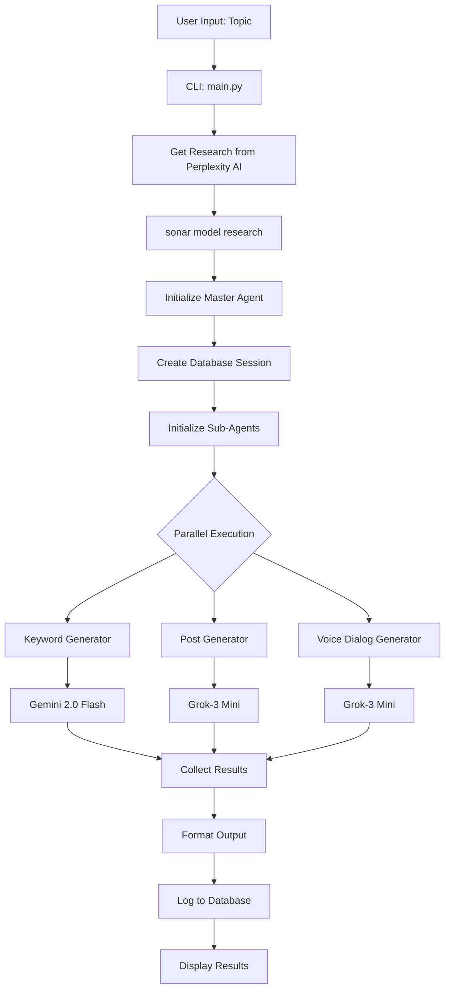

# Agentic Podcast Generator - Workflow Sequence

## Current Implementation Workflow

## Detailed Sequence

1. **User Input** → CLI parses topic and options
2. **Research Phase** → Perplexity AI (sonar) performs comprehensive research
3. **Master Agent Init** → Creates database session and initializes sub-agents
4. **Parallel Processing** → Three sub-agents run simultaneously:
   - **Keyword Generator** → Gemini 2.0 Flash creates keywords/hashtags
   - **Post Generator** → Grok-3 Mini creates LinkedIn post
   - **Voice Dialog Generator** → Grok-3 Mini creates podcast script
5. **Result Collection** → Master Agent gathers all results
6. **Output & Logging** → Formatted display + database persistence

## Key Implementation Notes

### Models Actually Used
- **Research**: `perplexity/sonar` (Perplexity AI) - NOT GPT-5
- **Keywords**: `google/gemini-2.0-flash-001` - NOT Gemini 2.5 Flash
- **Posts**: `xai/grok-3-mini` - NOT GPT-4
- **Voice**: `xai/grok-3-mini` - NOT Claude-3 Sonnet

### Workflow Phases
- **Sequential**: Research (Perplexity AI)
- **Parallel**: Content generation (3 agents simultaneously)
- **Sequential**: Result aggregation and output

### Important Clarifications
- **GPT-5 is NOT used** in the actual running system
- **Web Researcher agent exists** but is not used in main workflow
- **Perplexity AI integration** happens directly in `main.py`

This sequence diagram reflects the actual implementation as of the current codebase.