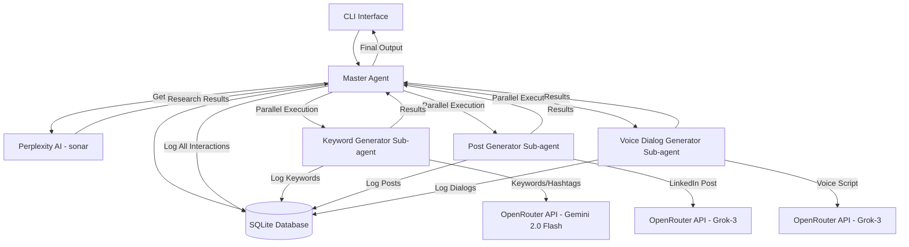

# Agentic System Architecture

## System Overview

This agentic system consists of a Master Agent that coordinates research and content generation through a streamlined workflow: research-first approach followed by parallel content generation.

## System Architecture



## Component Specifications

### 1. CLI Interface (main.py)
- **Purpose**: Command-line interface for user interaction
- **Responsibilities**:
  - Parse command-line arguments
  - Call Perplexity AI for research
  - Initialize Master Agent with research
  - Display formatted results
  - Handle error cases and logging

### 2. Perplexity AI Research (sonar model)
- **Purpose**: Perform comprehensive research on topics
- **Capabilities**:
  - Access to vast knowledge base
  - Current and up-to-date information
  - Structured research analysis
  - Fact verification and insights
- **Integration**: Called directly in `main.py` before Master Agent

### 3. Master Agent
- **Purpose**: Orchestrates the entire workflow and manages sub-agent lifecycle
- **Responsibilities**:
  - Accept research input from Perplexity
  - Initialize and coordinate sub-agents
  - Manage parallel execution of Keyword, Post, and Voice generators
  - Handle sequential processing and error recovery
  - Log all agent interactions
  - Store results in SQLite database

### 4. Keyword Generator Sub-agent
- **Purpose**: Generate SEO-optimized keywords and hashtags
- **Model**: Gemini 2.0 Flash (google/gemini-2.0-flash-001)
- **Output**: Keywords, hashtags, and relevance scores
- **Features**:
  - Analyzes research content for relevant terms
  - Categorizes keywords by search intent
  - Calculates relevance scores
  - Stores results in database

### 5. Post Generator Sub-agent
- **Purpose**: Create engaging LinkedIn posts
- **Model**: Grok-3 Mini (xai/grok-3-mini)
- **Style**: Casual, professional, and engaging
- **Input**: Research results and keywords
- **Features**:
  - Incorporates research insights naturally
  - Optimizes for LinkedIn engagement
  - Maintains brand voice and tone

### 6. Voice Dialog Generator Sub-agent
- **Purpose**: Convert LinkedIn posts to conversational voice scripts
- **Model**: Grok-3 Mini (xai/grok-3-mini)
- **Output**: Natural, podcast-ready dialog
- **Features**:
  - Adds pacing, emphasis, and engagement cues
  - Transforms written content to spoken format
  - Includes music cues and transitions

### 7. Database Layer (SQLite)
- **Purpose**: Persistent storage and session management
- **Tables**:
  - `sessions`: Workflow instances with status tracking
  - `agent_logs`: All agent actions and executions
  - `keywords`: Generated keywords and hashtags
  - `generated_content`: Posts and voice scripts

## Data Flow

1. **User Input**: Topic provided via CLI
2. **Research Phase**: Perplexity AI performs comprehensive research
3. **Master Coordination**: Research passed to Master Agent
4. **Parallel Generation**:
   - Keyword Generator creates keywords/hashtags
   - Post Generator creates LinkedIn content
   - Voice Dialog Generator creates podcast script
5. **Result Aggregation**: Master Agent collects all results
6. **Output & Logging**: Formatted display and database storage

## Technology Stack

- **Language**: Python 3.9+
- **Database**: SQLite3 with SQLAlchemy ORM
- **HTTP Client**: aiohttp for async API calls
- **CLI**: Click framework
- **Configuration**: python-dotenv
- **Logging**: Python logging with custom formatters

## Key Dependencies

```python
# requirements.txt
aiohttp>=3.9.0
click>=8.1.0
python-dotenv>=1.0.0
sqlalchemy>=2.0.0
aiosqlite>=0.19.0
pytest>=7.4.0
pytest-asyncio>=0.21.0
```

## Agent Communication Protocol

### Handoff Format
```python
{
    "from_agent": "master",
    "to_agent": "keyword_generator",
    "action": "generate_keywords",
    "payload": {
        "topic": "AI in healthcare",
        "research_response": "...",
        "requirements": ["seo_keywords", "hashtags", "relevance_scores"]
    },
    "timestamp": "2024-01-01T00:00:00Z",
    "session_id": 123
}
```

### Response Format
```python
{
    "from_agent": "keyword_generator",
    "to_agent": "master",
    "action": "keywords_generated",
    "payload": {
        "keywords": ["ai healthcare", "medical ai", ...],
        "hashtags": ["#AIHealthcare", "#MedicalAI", ...],
        "relevance_scores": {"ai healthcare": 0.95, ...}
    },
    "timestamp": "2024-01-01T00:00:15Z",
    "session_id": 123
}
```

## Error Handling Strategy

1. **Retry Mechanisms**: Exponential backoff for API failures
2. **Fallback Models**: Alternative OpenRouter models if primary fails
3. **Graceful Degradation**: Continue with partial results if sub-agent fails
4. **Comprehensive Logging**: All errors logged with context and session info
5. **Session Recovery**: Ability to resume from last successful step

## Configuration Management

```python
# config/settings.py
class SystemConfig:
    # Research models
    models["master"] = ModelConfig(name="sonar")  # Perplexity AI
    models["research"] = ModelConfig(name="sonar")  # Perplexity AI

    # Content generation models
    models["keyword"] = ModelConfig(name="google/gemini-2.0-flash-001")
    models["post"] = ModelConfig(name="xai/grok-3-mini")
    models["dialog"] = ModelConfig(name="xai/grok-3-mini")
```

## Implementation Phases

### Phase 1: Core Infrastructure ✅
- Project setup and dependencies
- Database schema and connection
- OpenRouter API client
- Base Agent class

### Phase 2: Research Integration ✅
- Perplexity AI integration
- CLI interface
- Basic research workflow

### Phase 3: Content Generation Agents ✅
- Keyword Generator (Gemini 2.0 Flash)
- Post Generator (Grok-3 Mini)
- Voice Dialog Generator (Grok-3 Mini)
- Parallel execution framework

### Phase 4: Integration and Refinement ✅
- Master Agent orchestration
- Session management
- Error handling and logging
- Performance optimization

## Success Metrics

1. **Functionality**: All agents complete their tasks successfully
2. **Performance**: End-to-end execution within reasonable time limits
3. **Reliability**: Graceful handling of API failures and errors
4. **Usability**: Clear CLI interface and comprehensive logging
5. **Maintainability**: Well-structured, documented code with accurate configuration

## Important Notes

### Model Usage Clarification
- **Research**: `perplexity/sonar` (Perplexity AI) - NOT GPT-5
- **Keywords**: `google/gemini-2.0-flash-001` - NOT Gemini 2.5 Flash
- **Posts & Voice**: `xai/grok-3-mini` - NOT GPT-4 or Claude-3 Sonnet

### GPT-5 References
**GPT-5 is NOT used anywhere in the actual running application.** Despite some outdated references in documentation and tests, the system uses the models listed above.

### Web Research Status
The system includes a `WebResearcher` agent with tool-calling capabilities, but it is **not used** in the current workflow. The system currently relies on Perplexity AI for research instead.

This architecture provides a robust foundation for building a sophisticated agentic system with clear separation of concerns, comprehensive logging, and scalable design patterns.