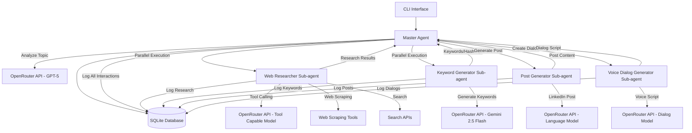

# Agentic System Architecture Plan

## System Overview

This agentic system consists of a Master Agent orchestrating multiple specialized Sub-agents to process topics and generate content through a sequential pipeline with parallel processing capabilities.

## System Architecture



## Component Specifications

### 1. Master Agent
- **Purpose**: Orchestrates the entire workflow and manages sub-agent lifecycle
- **Responsibilities**:
  - Accept topic input from CLI
  - Analyze topic using GPT-5 via OpenRouter
  - Spawn and coordinate sub-agents
  - Manage parallel execution of Web Researcher and Keyword Generator
  - Handle sequential execution of Post Generator and Voice Dialog Generator
  - Log all agent handoffs and interactions
  - Store results in SQLite database

### 2. Web Researcher Sub-agent
- **Purpose**: Research the given topic comprehensively
- **Capabilities**:
  - Web scraping using BeautifulSoup/Scrapy
  - Search API integration (Google Custom Search, Bing, etc.)
  - Content analysis and summarization
  - Fact verification and source validation
- **OpenRouter Model**: Tool-calling capable model (e.g., GPT-4, Claude-3)
- **Tools Available**: Web scraping, search APIs, content extraction

### 3. Keyword Generator Sub-agent
- **Purpose**: Generate relevant keywords and hashtags
- **OpenRouter Model**: Gemini 2.5 Flash
- **Output**: Structured keywords and hashtags for social media optimization

### 4. LinkedIn Post Generator Sub-agent
- **Purpose**: Create casual, engaging LinkedIn posts
- **Input**: Research results + keywords
- **OpenRouter Model**: Language model optimized for content creation
- **Output**: Casual, professional LinkedIn post content

### 5. Voice Dialog Generator Sub-agent
- **Purpose**: Convert LinkedIn post into conversational voice dialog
- **OpenRouter Model**: Model capable of dialog generation
- **Output**: Natural, conversational voice script format

## Database Schema

```sql
-- Agent Sessions
CREATE TABLE sessions (
    id INTEGER PRIMARY KEY AUTOINCREMENT,
    topic TEXT NOT NULL,
    created_at TIMESTAMP DEFAULT CURRENT_TIMESTAMP,
    status TEXT DEFAULT 'active'
);

-- Agent Logs
CREATE TABLE agent_logs (
    id INTEGER PRIMARY KEY AUTOINCREMENT,
    session_id INTEGER,
    agent_name TEXT NOT NULL,
    action TEXT NOT NULL,
    input_data TEXT,
    output_data TEXT,
    timestamp TIMESTAMP DEFAULT CURRENT_TIMESTAMP,
    duration_ms INTEGER,
    FOREIGN KEY (session_id) REFERENCES sessions (id)
);

-- Research Results
CREATE TABLE research_results (
    id INTEGER PRIMARY KEY AUTOINCREMENT,
    session_id INTEGER,
    source_url TEXT,
    content TEXT,
    relevance_score REAL,
    timestamp TIMESTAMP DEFAULT CURRENT_TIMESTAMP,
    FOREIGN KEY (session_id) REFERENCES sessions (id)
);

-- Keywords and Hashtags
CREATE TABLE keywords (
    id INTEGER PRIMARY KEY AUTOINCREMENT,
    session_id INTEGER,
    keyword TEXT NOT NULL,
    hashtag TEXT,
    relevance_score REAL,
    FOREIGN KEY (session_id) REFERENCES sessions (id)
);

-- Generated Content
CREATE TABLE generated_content (
    id INTEGER PRIMARY KEY AUTOINCREMENT,
    session_id INTEGER,
    content_type TEXT NOT NULL, -- 'linkedin_post', 'voice_dialog'
    content TEXT NOT NULL,
    metadata TEXT, -- JSON metadata
    created_at TIMESTAMP DEFAULT CURRENT_TIMESTAMP,
    FOREIGN KEY (session_id) REFERENCES sessions (id)
);
```

## Data Flow

1. **User Input**: Topic provided via CLI
2. **Master Analysis**: GPT-5 analyzes topic and creates execution plan
3. **Parallel Processing**:
   - Web Researcher: Gathers comprehensive research data
   - Keyword Generator: Creates relevant keywords/hashtags
4. **Sequential Processing**:
   - Post Generator: Creates LinkedIn post using research + keywords
   - Voice Dialog Generator: Converts post to conversational format
5. **Logging**: All interactions logged to console and database

## Technology Stack

- **Language**: Python 3.9+
- **Database**: SQLite3 with SQLAlchemy ORM
- **HTTP Client**: aiohttp for async API calls
- **Web Scraping**: BeautifulSoup4, Scrapy (optional)
- **CLI**: Click or argparse
- **Logging**: Python logging module with custom formatters
- **Configuration**: Python-dotenv for environment variables
- **Testing**: pytest with asyncio support

## Key Dependencies

```python
# requirements.txt
aiohttp>=3.8.0
sqlalchemy>=2.0.0
beautifulsoup4>=4.11.0
click>=8.1.0
python-dotenv>=1.0.0
pytest>=7.0.0
pytest-asyncio>=0.21.0
requests>=2.28.0
scrapy>=2.7.0  # Optional for advanced scraping
```

## Agent Communication Protocol

### Handoff Format
```python
{
    "from_agent": "master",
    "to_agent": "web_researcher",
    "action": "research_topic",
    "payload": {
        "topic": "AI in healthcare",
        "analysis": "...",
        "requirements": ["recent_developments", "key_players", "challenges"]
    },
    "timestamp": "2024-01-15T10:30:00Z",
    "session_id": "uuid-string"
}
```

### Response Format
```python
{
    "from_agent": "web_researcher",
    "to_agent": "master",
    "action": "research_complete",
    "payload": {
        "research_summary": "...",
        "sources": [...],
        "key_findings": [...],
        "confidence_score": 0.85
    },
    "timestamp": "2024-01-15T10:35:00Z",
    "session_id": "uuid-string"
}
```

## Error Handling Strategy

1. **Retry Mechanisms**: Exponential backoff for API failures
2. **Fallback Models**: Alternative OpenRouter models if primary fails
3. **Graceful Degradation**: Continue with partial results if sub-agent fails
4. **Comprehensive Logging**: All errors logged with context
5. **Recovery Procedures**: Ability to resume from last successful step

## Configuration Management

```python
# config.py
class Config:
    OPENROUTER_API_KEY = os.getenv("OPENROUTER_API_KEY")
    DATABASE_URL = os.getenv("DATABASE_URL", "sqlite:///agentic_system.db")
    
    # Model configurations
    MASTER_MODEL = "openai/gpt-5"
    RESEARCH_MODEL = "anthropic/claude-3-opus"
    KEYWORD_MODEL = "google/gemini-2.5-flash"
    POST_MODEL = "openai/gpt-4"
    DIALOG_MODEL = "anthropic/claude-3-sonnet"
    
    # API limits and timeouts
    MAX_RETRIES = 3
    TIMEOUT_SECONDS = 30
    RATE_LIMIT_REQUESTS_PER_MINUTE = 60
```

## Implementation Phases

### Phase 1: Core Infrastructure
- Project setup and dependencies
- Database schema and connection
- OpenRouter API client
- Base Agent class

### Phase 2: Master Agent
- CLI interface
- Topic analysis
- Agent orchestration
- Logging system

### Phase 3: Sub-agents Implementation
- Web Researcher with tool calling
- Keyword Generator
- Post Generator
- Voice Dialog Generator

### Phase 4: Integration and Testing
- End-to-end workflow testing
- Error handling refinement
- Performance optimization
- Documentation

## Success Metrics

1. **Functionality**: All agents complete their tasks successfully
2. **Performance**: End-to-end execution within reasonable time limits
3. **Reliability**: Graceful handling of API failures and errors
4. **Usability**: Clear CLI interface and comprehensive logging
5. **Maintainability**: Well-structured, documented code

This architecture provides a robust foundation for building a sophisticated agentic system with clear separation of concerns, comprehensive logging, and scalable design patterns.