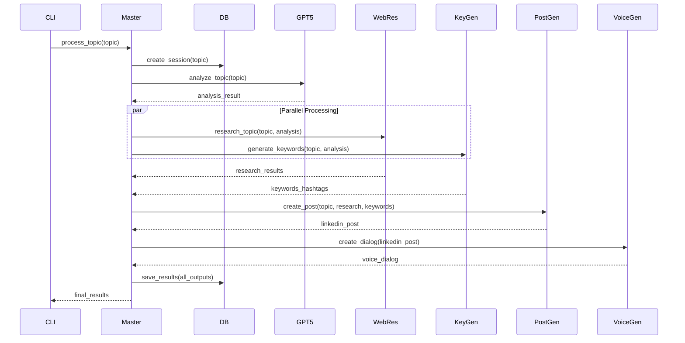

# Technical Specifications and Dependencies

## Dependencies and Requirements

### Python Requirements (requirements.txt)
```txt
# Core Framework
asyncio>=3.4.3
click>=8.1.7
python-dotenv>=1.0.0

# Database
sqlalchemy>=2.0.23
alembic>=1.13.1
aiosqlite>=0.19.0

# HTTP and API
aiohttp>=3.9.1
requests>=2.31.0

# Web Scraping and Search
beautifulsoup4>=4.12.2
scrapy>=2.11.0
selenium>=4.16.2
google-api-python-client>=2.112.0

# Data Processing
pydantic>=2.5.2
jsonschema>=4.20.0

# Logging and Monitoring
structlog>=23.2.0
colorlog>=6.8.0

# Testing
pytest>=7.4.3
pytest-asyncio>=0.21.1
pytest-mock>=3.12.0
httpx>=0.25.2

# Development Tools
black>=23.12.0
flake8>=6.1.0
mypy>=1.8.0
```

### Environment Configuration (.env.example)
```bash
# OpenRouter API Configuration
OPENROUTER_API_KEY=your_openrouter_api_key_here

# Database Configuration
DATABASE_URL=sqlite+aiosqlite:///./agentic_system.db

# Model Configurations
MASTER_MODEL=openai/gpt-5
RESEARCH_MODEL=anthropic/claude-3-opus
KEYWORD_MODEL=google/gemini-2.5-flash
POST_MODEL=openai/gpt-4
DIALOG_MODEL=anthropic/claude-3-sonnet

# API Configuration
MAX_RETRIES=3
TIMEOUT_SECONDS=30
RATE_LIMIT_REQUESTS_PER_MINUTE=60

# Search API Keys (Optional)
GOOGLE_API_KEY=your_google_api_key_here
GOOGLE_CSE_ID=your_google_cse_id_here
BING_API_KEY=your_bing_api_key_here

# Logging Configuration
LOG_LEVEL=INFO
LOG_FILE=agentic_system.log

# Web Scraping Configuration
USER_AGENT=AgenticSystem/1.0.0
MAX_CONCURRENT_REQUESTS=10
REQUEST_DELAY=1.0
```

## Detailed Agent Specifications

### Master Agent Workflow


### Web Researcher Agent Tools
```python
# Tool definitions for web researcher
RESEARCH_TOOLS = [
    {
        "type": "function",
        "function": {
            "name": "web_search",
            "description": "Search the web for information on a specific topic",
            "parameters": {
                "type": "object",
                "properties": {
                    "query": {
                        "type": "string",
                        "description": "Search query"
                    },
                    "num_results": {
                        "type": "integer", 
                        "description": "Number of results to return",
                        "default": 10
                    }
                },
                "required": ["query"]
            }
        }
    },
    {
        "type": "function",
        "function": {
            "name": "scrape_webpage",
            "description": "Extract content from a specific webpage",
            "parameters": {
                "type": "object",
                "properties": {
                    "url": {
                        "type": "string",
                        "description": "URL to scrape"
                    },
                    "extract_type": {
                        "type": "string",
                        "enum": ["text", "links", "metadata"],
                        "description": "Type of content to extract"
                    }
                },
                "required": ["url"]
            }
        }
    },
    {
        "type": "function", 
        "function": {
            "name": "analyze_content",
            "description": "Analyze scraped content for relevance and key insights",
            "parameters": {
                "type": "object",
                "properties": {
                    "content": {
                        "type": "string",
                        "description": "Content to analyze"
                    },
                    "topic": {
                        "type": "string",
                        "description": "Original topic for relevance scoring"
                    }
                },
                "required": ["content", "topic"]
            }
        }
    }
]
```

### Database Models Detail
```sql
-- Complete SQLite Schema
BEGIN TRANSACTION;

-- Sessions table
CREATE TABLE sessions (
    id INTEGER PRIMARY KEY AUTOINCREMENT,
    topic TEXT NOT NULL,
    analysis TEXT,
    created_at TIMESTAMP DEFAULT CURRENT_TIMESTAMP,
    completed_at TIMESTAMP,
    status TEXT DEFAULT 'active' CHECK(status IN ('active', 'completed', 'failed', 'cancelled')),
    error_message TEXT
);

-- Agent execution logs
CREATE TABLE agent_logs (
    id INTEGER PRIMARY KEY AUTOINCREMENT,
    session_id INTEGER NOT NULL,
    agent_name TEXT NOT NULL,
    action TEXT NOT NULL,
    input_data TEXT, -- JSON
    output_data TEXT, -- JSON
    timestamp TIMESTAMP DEFAULT CURRENT_TIMESTAMP,
    duration_ms INTEGER,
    success BOOLEAN DEFAULT TRUE,
    error_message TEXT,
    FOREIGN KEY (session_id) REFERENCES sessions (id) ON DELETE CASCADE
);

-- Research results from web researcher
CREATE TABLE research_results (
    id INTEGER PRIMARY KEY AUTOINCREMENT,
    session_id INTEGER NOT NULL,
    source_url TEXT,
    title TEXT,
    content TEXT NOT NULL,
    relevance_score REAL DEFAULT 0.0,
    credibility_score REAL DEFAULT 0.0,
    timestamp TIMESTAMP DEFAULT CURRENT_TIMESTAMP,
    metadata TEXT, -- JSON for additional data
    FOREIGN KEY (session_id) REFERENCES sessions (id) ON DELETE CASCADE
);

-- Keywords and hashtags
CREATE TABLE keywords (
    id INTEGER PRIMARY KEY AUTOINCREMENT,
    session_id INTEGER NOT NULL,
    keyword TEXT NOT NULL,
    keyword_type TEXT DEFAULT 'keyword' CHECK(keyword_type IN ('keyword', 'hashtag')),
    relevance_score REAL DEFAULT 0.0,
    category TEXT,
    FOREIGN KEY (session_id) REFERENCES sessions (id) ON DELETE CASCADE
);

-- Generated content (posts, dialogs)
CREATE TABLE generated_content (
    id INTEGER PRIMARY KEY AUTOINCREMENT,
    session_id INTEGER NOT NULL,
    content_type TEXT NOT NULL CHECK(content_type IN ('linkedin_post', 'voice_dialog')),
    content TEXT NOT NULL,
    metadata TEXT, -- JSON metadata (word count, tone, etc.)
    quality_score REAL DEFAULT 0.0,
    created_at TIMESTAMP DEFAULT CURRENT_TIMESTAMP,
    FOREIGN KEY (session_id) REFERENCES sessions (id) ON DELETE CASCADE
);

-- Agent handoffs tracking
CREATE TABLE agent_handoffs (
    id INTEGER PRIMARY KEY AUTOINCREMENT,
    session_id INTEGER NOT NULL,
    from_agent TEXT NOT NULL,
    to_agent TEXT NOT NULL,
    action TEXT NOT NULL,
    payload TEXT, -- JSON
    timestamp TIMESTAMP DEFAULT CURRENT_TIMESTAMP,
    response_time_ms INTEGER,
    FOREIGN KEY (session_id) REFERENCES sessions (id) ON DELETE CASCADE
);

-- Indexes for performance
CREATE INDEX idx_agent_logs_session ON agent_logs(session_id);
CREATE INDEX idx_agent_logs_timestamp ON agent_logs(timestamp);
CREATE INDEX idx_research_session ON research_results(session_id);
CREATE INDEX idx_keywords_session ON keywords(session_id);
CREATE INDEX idx_content_session ON generated_content(session_id);
CREATE INDEX idx_handoffs_session ON agent_handoffs(session_id);

COMMIT;
```

## Configuration Management System

### Config Class Structure
```python
from typing import Dict, Any, Optional
from dataclasses import dataclass
import os
from pathlib import Path

@dataclass
class ModelConfig:
    """Configuration for OpenRouter models"""
    name: str
    max_tokens: int = 4000
    temperature: float = 0.7
    top_p: float = 1.0
    timeout: int = 30

@dataclass 
class AgentConfig:
    """Configuration for individual agents"""
    name: str
    model: ModelConfig
    max_retries: int = 3
    tools: Optional[list] = None

class SystemConfig:
    """Main system configuration"""
    
    def __init__(self):
        self.load_from_env()
        self.setup_models()
        self.setup_agents()
    
    def load_from_env(self):
        """Load configuration from environment variables"""
        self.openrouter_api_key = os.getenv("OPENROUTER_API_KEY")
        self.database_url = os.getenv("DATABASE_URL", "sqlite+aiosqlite:///./agentic_system.db")
        self.log_level = os.getenv("LOG_LEVEL", "INFO")
        self.max_retries = int(os.getenv("MAX_RETRIES", "3"))
        self.timeout_seconds = int(os.getenv("TIMEOUT_SECONDS", "30"))
        
    def setup_models(self):
        """Configure OpenRouter models"""
        self.models = {
            "master": ModelConfig(
                name=os.getenv("MASTER_MODEL", "openai/gpt-5"),
                max_tokens=4000,
                temperature=0.7
            ),
            "research": ModelConfig(
                name=os.getenv("RESEARCH_MODEL", "anthropic/claude-3-opus"),
                max_tokens=8000,
                temperature=0.3
            ),
            "keyword": ModelConfig(
                name=os.getenv("KEYWORD_MODEL", "google/gemini-2.5-flash"),
                max_tokens=2000,
                temperature=0.5
            ),
            "post": ModelConfig(
                name=os.getenv("POST_MODEL", "openai/gpt-4"),
                max_tokens=1000,
                temperature=0.8
            ),
            "dialog": ModelConfig(
                name=os.getenv("DIALOG_MODEL", "anthropic/claude-3-sonnet"),
                max_tokens=3000,
                temperature=0.9
            )
        }
```

## Error Handling and Retry Strategies

### Retry Decorator Implementation
```python
import asyncio
import functools
from typing import Callable, Any, Type
import logging

def retry_with_backoff(
    max_retries: int = 3,
    base_delay: float = 1.0,
    max_delay: float = 60.0,
    exponential_base: float = 2.0,
    exceptions: tuple = (Exception,)
):
    """Decorator for retrying operations with exponential backoff"""
    
    def decorator(func: Callable) -> Callable:
        @functools.wraps(func)
        async def wrapper(*args, **kwargs) -> Any:
            last_exception = None
            
            for attempt in range(max_retries + 1):
                try:
                    return await func(*args, **kwargs)
                except exceptions as e:
                    last_exception = e
                    
                    if attempt == max_retries:
                        break
                    
                    delay = min(
                        base_delay * (exponential_base ** attempt),
                        max_delay
                    )
                    
                    logging.warning(
                        f"Attempt {attempt + 1} failed for {func.__name__}: {e}. "
                        f"Retrying in {delay:.2f} seconds..."
                    )
                    
                    await asyncio.sleep(delay)
            
            raise last_exception
        
        return wrapper
    return decorator
```

## Logging Configuration

### Structured Logging Setup
```python
import structlog
import logging
from datetime import datetime
from typing import Dict, Any

def setup_logging(log_level: str = "INFO", log_file: str = None):
    """Configure structured logging for the system"""
    
    # Configure structlog
    structlog.configure(
        processors=[
            structlog.stdlib.filter_by_level,
            structlog.stdlib.add_logger_name,
            structlog.stdlib.add_log_level,
            structlog.stdlib.PositionalArgumentsFormatter(),
            structlog.processors.TimeStamper(fmt="iso"),
            structlog.processors.StackInfoRenderer(),
            structlog.processors.format_exc_info,
            structlog.processors.UnicodeDecoder(),
            structlog.processors.JSONRenderer()
        ],
        context_class=dict,
        logger_factory=structlog.stdlib.LoggerFactory(),
        wrapper_class=structlog.stdlib.BoundLogger,
        cache_logger_on_first_use=True,
    )
    
    # Configure standard logging
    logging.basicConfig(
        format="%(message)s",
        level=getattr(logging, log_level.upper()),
        handlers=[
            logging.StreamHandler(),
            *(logging.FileHandler(log_file)] if log_file else [])
        ]
    )

class AgentLogger:
    """Specialized logger for agent actions"""
    
    def __init__(self, agent_name: str):
        self.agent_name = agent_name
        self.logger = structlog.get_logger(agent_name)
    
    def log_handoff(self, from_agent: str, to_agent: str, action: str, payload: Dict[str, Any]):
        """Log agent handoff"""
        self.logger.info(
            "Agent handoff",
            from_agent=from_agent,
            to_agent=to_agent,
            action=action,
            payload_size=len(str(payload))
        )
    
    def log_execution(self, action: str, duration_ms: int, success: bool, error: str = None):
        """Log agent execution"""
        self.logger.info(
            "Agent execution",
            action=action,
            duration_ms=duration_ms,
            success=success,
            error=error
        )
```

## Performance Optimization Strategies

### Async Task Management
- Use asyncio.gather() for parallel sub-agent execution
- Implement task timeouts to prevent hanging
- Connection pooling for database operations
- Rate limiting for OpenRouter API calls

### Memory Management
- Stream large web scraping results instead of loading into memory
- Implement pagination for database queries
- Use generator functions for processing large datasets
- Clean up temporary files and connections

### Caching Strategy
- Cache frequently accessed model configurations
- Store web scraping results temporarily to avoid re-scraping
- Cache successful API responses for identical requests
- Implement intelligent cache invalidation

This technical specification provides the foundation for implementing a robust, scalable agentic system with comprehensive error handling, logging, and performance optimization.