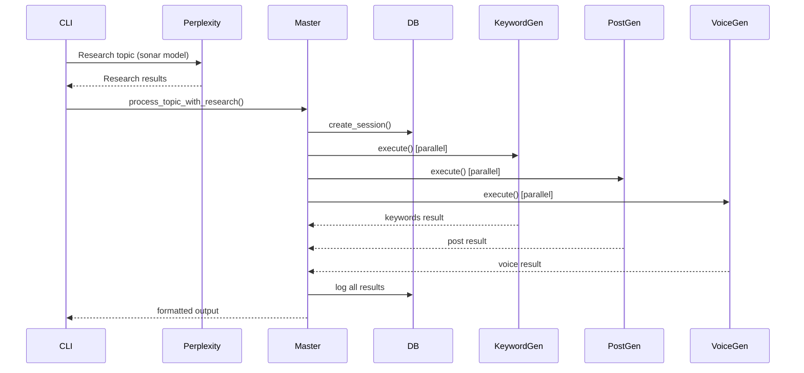

# Technical Specifications and Dependencies

## Dependencies and Requirements

### Python Requirements (requirements.txt)
```txt
# Core Framework
asyncio>=3.4.3
click>=8.1.7
python-dotenv>=1.0.0

# Database
sqlalchemy>=2.0.23
aiosqlite>=0.19.0

# HTTP and API
aiohttp>=3.9.1
requests>=2.31.0

# Data Processing
pydantic>=2.5.2

# Logging and Monitoring
structlog>=23.2.0
colorlog>=6.8.0

# Testing
pytest>=7.4.3
pytest-asyncio>=0.21.1
pytest-mock>=3.12.0
httpx>=0.25.2

# Development Tools
black>=23.12.0
flake8>=6.1.0
mypy>=1.8.0
```

### Environment Configuration (.env.example)
```bash
# OpenRouter API Configuration (Required)
OPENROUTER_API_KEY=your_openrouter_api_key_here

# Database Configuration
DATABASE_URL=sqlite+aiosqlite:///./agentic_system.db

# Model Configurations (Optional - these are the actual defaults used)
# Research uses Perplexity AI sonar model
MASTER_MODEL=sonar
RESEARCH_MODEL=sonar

# Content generation uses Gemini and Grok models
KEYWORD_MODEL=google/gemini-2.0-flash-001
POST_MODEL=xai/grok-3-mini
DIALOG_MODEL=xai/grok-3-mini

# System Configuration
MAX_RETRIES=3
TIMEOUT_SECONDS=120
LOG_LEVEL=INFO

# Legacy/Optional - Not currently used in main workflow
GOOGLE_API_KEY=your_google_api_key_here
GOOGLE_CSE_ID=your_google_cse_id_here
BING_API_KEY=your_bing_api_key_here
USER_AGENT=AgenticSystem/1.0.0
MAX_CONCURRENT_REQUESTS=10
REQUEST_DELAY=1.0
```

## System Architecture Overview

### Actual Workflow Implementation

The system follows this actual workflow:

1. **CLI Entry Point** (`main.py`)
   - Parse command-line arguments
   - Call Perplexity AI (sonar model) for research
   - Initialize Master Agent with research results
   - Display formatted output

2. **Research Phase** (Sequential)
   - Perplexity AI performs comprehensive topic research
   - Returns detailed analysis and insights

3. **Master Agent Coordination**
   - Receives research from Perplexity
   - Initializes sub-agents for parallel execution
   - Manages session tracking and logging

4. **Parallel Content Generation**
   - **Keyword Generator**: Gemini 2.0 Flash creates keywords/hashtags
   - **Post Generator**: Grok-3 Mini creates LinkedIn posts
   - **Voice Dialog Generator**: Grok-3 Mini creates podcast scripts

5. **Output & Persistence**
   - Formatted results displayed to user
   - All interactions logged to SQLite database

### Key Implementation Details

#### Model Usage (Actual vs. Documentation)
- **Research**: `perplexity/sonar` (Perplexity AI) - NOT GPT-5
- **Keywords**: `google/gemini-2.0-flash-001` - NOT Gemini 2.5 Flash
- **Posts**: `xai/grok-3-mini` - NOT GPT-4
- **Voice**: `xai/grok-3-mini` - NOT Claude-3 Sonnet

#### Workflow Phases


#### Database Schema (Actual Implementation)

```sql
-- Sessions table
CREATE TABLE sessions (
    id INTEGER PRIMARY KEY AUTOINCREMENT,
    topic TEXT NOT NULL,
    created_at TIMESTAMP DEFAULT CURRENT_TIMESTAMP,
    status TEXT DEFAULT 'active'
);

-- Agent logs table
CREATE TABLE agent_logs (
    id INTEGER PRIMARY KEY AUTOINCREMENT,
    session_id INTEGER,
    agent_name TEXT NOT NULL,
    action TEXT NOT NULL,
    input_data TEXT,
    output_data TEXT,
    timestamp TIMESTAMP DEFAULT CURRENT_TIMESTAMP,
    duration_ms INTEGER,
    FOREIGN KEY (session_id) REFERENCES sessions (id)
);

-- Keywords table
CREATE TABLE keywords (
    id INTEGER PRIMARY KEY AUTOINCREMENT,
    session_id INTEGER,
    keyword TEXT NOT NULL,
    keyword_type TEXT,
    relevance_score REAL,
    category TEXT,
    FOREIGN KEY (session_id) REFERENCES sessions (id)
);

-- Generated content table
CREATE TABLE generated_content (
    id INTEGER PRIMARY KEY AUTOINCREMENT,
    session_id INTEGER,
    content_type TEXT NOT NULL,
    content TEXT NOT NULL,
    metadata TEXT,
    created_at TIMESTAMP DEFAULT CURRENT_TIMESTAMP,
    FOREIGN KEY (session_id) REFERENCES sessions (id)
);
```

## Agent Specifications

### Master Agent
- **Location**: `agents/master_agent.py`
- **Purpose**: Orchestrates the entire workflow
- **Key Methods**:
  - `process_topic_with_research()`: Main workflow entry point
  - `initialize_all_agents()`: Sets up sub-agents
  - `get_perplexity_research()`: Calls Perplexity AI (legacy method)

### Sub-Agents

#### Keyword Generator
- **Location**: `agents/sub_agents/keyword_generator.py`
- **Model**: `google/gemini-2.0-flash-001`
- **Purpose**: Generate SEO keywords and hashtags
- **Output**: Keywords list, hashtags list, relevance scores

#### Post Generator
- **Location**: `agents/sub_agents/post_generator.py`
- **Model**: `xai/grok-3-mini`
- **Purpose**: Create LinkedIn posts
- **Input**: Topic, research results, keywords
- **Output**: Formatted LinkedIn post content

#### Voice Dialog Generator
- **Location**: `agents/sub_agents/voice_dialog.py`
- **Model**: `xai/grok-3-mini`
- **Purpose**: Convert posts to podcast scripts
- **Input**: Topic, research results
- **Output**: Conversational voice dialog script

#### Web Researcher (Legacy)
- **Location**: `agents/sub_agents/web_researcher.py`
- **Status**: Implemented but NOT used in main workflow
- **Purpose**: Web research capabilities (available for future use)
- **Note**: Current system uses Perplexity AI instead

## Configuration System

### Settings Structure
```python
# config/settings.py
class SystemConfig:
    # API Keys
    openrouter_api_key: str

    # Database
    database_url: str

    # Models configuration
    models: Dict[str, ModelConfig] = {
        "master": ModelConfig(name="sonar"),
        "research": ModelConfig(name="sonar"),
        "keyword": ModelConfig(name="google/gemini-2.0-flash-001"),
        "post": ModelConfig(name="xai/grok-3-mini"),
        "dialog": ModelConfig(name="xai/grok-3-mini")
    }

    # Agent configurations
    agents: Dict[str, AgentConfig]
```

### Model Configuration Details

```python
@dataclass
class ModelConfig:
    name: str
    max_tokens: int = 4000
    temperature: float = 0.7
    top_p: float = 1.0
    timeout: int = 30

@dataclass
class AgentConfig:
    name: str
    model: ModelConfig
    max_retries: int = 3
    tools: Optional[list] = None
```

## Important Notes

### GPT-5 References
**GPT-5 is NOT used anywhere in the actual running application.** References to GPT-5 exist in:
- Some documentation files (outdated)
- Test files (expecting old defaults)
- Example code (speculative)

### Web Research Capabilities
The system includes a `WebResearcher` agent with tool-calling capabilities, but it is **not used** in the current workflow. The system currently relies on Perplexity AI for research instead.

### Model Accuracy
Always verify the actual models being used by checking:
- `config/settings.py` for model configurations
- `main.py` for the research call (uses `sonar`)
- Agent implementations for their specific model usage

This documentation reflects the actual implementation as of the current codebase.